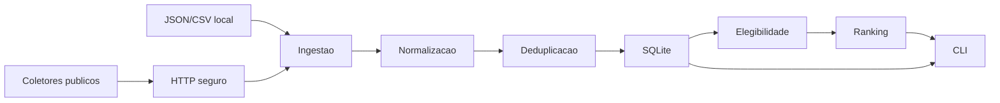

# Arquitetura

## Decisao Principal

Radar de Vagas e um monolito modular em Python. A aplicacao roda localmente, usa
SQLite como banco e separa camadas por responsabilidade:

- CLI: entrada e apresentacao no terminal.
- Configuracao: leitura e validacao de YAML e variaveis de ambiente.
- HTTP: cliente central com GET/HEAD, timeouts, retry, redirects, cache e SSRF.
- Coletores: JobPosting JSON-LD, Greenhouse e Lever.
- Ingestao: importacao de fixture, arquivos JSON/CSV e DTOs coletados.
- Canonicalizacao: normalizacao de textos, URLs, empresas e localidades.
- Deduplicacao: deteccao exata de publicacoes e candidatos provaveis.
- Elegibilidade: regras puras e testaveis.
- Ranking: pontuacao deterministica e explicavel.
- Persistencia: SQLAlchemy, sessoes, modelos e migracoes Alembic.

## Dependencias Permitidas

O projeto usa Python 3.12+, SQLAlchemy 2.x, Alembic, Pydantic 2.x, Typer, Rich,
PyYAML, httpx, beautifulsoup4, pytest, Ruff e mypy. Nao ha Django, Flask,
FastAPI, Streamlit, PostgreSQL, Redis, Celery ou Docker obrigatorio.

## Fluxo

1. `radar init-db` cria diretorios e aplica migracoes.
2. `radar validate-file` simula importacoes JSON/CSV sem escrita.
3. `radar import-file` valida, gera relatorio opcional, cria fontes, empresas,
   publicacoes, auditoria de origem e vagas canonicas quando seguro.
4. `radar import-url` coleta uma unica pagina publica com JSON-LD `JobPosting`.
5. `radar collect-board` coleta um board publico Greenhouse ou Lever.
6. `radar collect-all` coleta os boards ativos configurados.
7. O orquestrador registra `SourceRun`, atualiza publicacoes conhecidas, cria
   revisoes quando conteudo muda e fecha publicacoes ausentes somente apos o
   limite configurado de snapshots completos.
8. `radar evaluate-all`, `radar list-jobs`, `radar show-job`, `radar stats`,
   `radar boards` e `radar source-health` consultam ou atualizam o banco.

## Rollback

Na importacao generica, itens invalidos sao separados antes da escrita. Para os
itens validos, a unidade de rollback e o arquivo inteiro. Na coleta publica, uma
falha controlada registra a execucao como falha e nao incrementa ausencias nem
fecha publicacoes.

## Decisoes Adiadas

- Busca global por empresas.
- Crawling recursivo ou busca no Google.
- LinkedIn, Indeed, Glassdoor, Gupy, Solides e Pandape.
- Gmail e classificacao de e-mails.
- Geracao de curriculo.
- Interpretacao semantica ampla ou IA.
- Playwright.
- Candidatura automatica ou envio de formulario.
- Interface web.

## Por Que SQLite

SQLite atende ao escopo local-first, reduz configuracao, facilita testes
isolados e evita infraestrutura externa. Microservicos foram evitados porque a
primeira versao precisa de coesao, portabilidade e simplicidade operacional.
