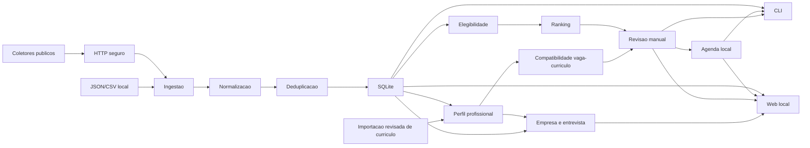

# Arquitetura

## Decisao Principal

Radar de Vagas e um monolito modular em Python. A aplicacao roda localmente, usa
SQLite como banco e separa camadas por responsabilidade:

- CLI: entrada e apresentacao no terminal.
- Configuracao: leitura e validacao de YAML e variaveis de ambiente.
- HTTP: cliente central com GET/HEAD, timeouts, retry, redirects, cache e SSRF.
- Coletores: JobPosting JSON-LD, Greenhouse, Lever e Gupy Public Portal.
- Ingestao: importacao de fixture, arquivos JSON/CSV e DTOs coletados.
- Canonicalizacao: normalizacao de textos, URLs, empresas e localidades.
- Deduplicacao: deteccao exata de publicacoes e candidatos provaveis.
- Elegibilidade: regras puras e testaveis.
- Relevancia: classificacao deterministica de area profissional.
- Ranking: pontuacao deterministica e explicavel.
- Perfil profissional: importacao local versionada e evidencias.
- Compatibilidade: comparacao explicavel entre vaga e curriculo.
- Revisao e candidaturas: politica central de estados, fila manual, guardas,
  historico local e redutor de timeline.
- Agenda local: prazos, entrevistas, testes e follow-ups sem calendario externo.
- Inteligencia de empresas: perfil local, fatos por origem, relatos informativos
  e preparacao deterministica de entrevista.
- Interface web local: FastAPI, Jinja2 e HTML/CSS server-side para operar o
  mesmo banco local pelo navegador.
- Importacao revisada de curriculo: extracao local de PDF/DOCX/TXT/Markdown,
  candidatos auditaveis e confirmacao humana.
- Persistencia: SQLAlchemy, sessoes, modelos e migracoes Alembic.

## Dependencias Permitidas

O projeto usa Python 3.12+, SQLAlchemy 2.x, Alembic, Pydantic 2.x, Typer, Rich,
PyYAML, httpx, beautifulsoup4, pytest, Ruff e mypy. A interface web e extra
opcional e usa FastAPI, Uvicorn, Jinja2, python-multipart, itsdangerous, pypdf
e python-docx. Os leitores de PDF/DOCX sao importados de forma preguiçosa no
modulo de curriculo; a CLI e o nucleo continuam funcionando sem instalar o
extra `web`. Nao ha Django, Flask, Streamlit, PostgreSQL, Redis, Celery ou
Docker obrigatorio.

## Fluxo

1. `radar init-db` cria diretorios e aplica migracoes.
2. `radar validate-file` simula importacoes JSON/CSV sem escrita.
3. `radar import-file` valida, gera relatorio opcional, cria fontes, empresas,
   publicacoes, auditoria de origem e vagas canonicas quando seguro.
4. `radar import-url` coleta uma unica pagina publica com JSON-LD `JobPosting`.
5. `radar collect-board` coleta um board publico Greenhouse ou Lever.
6. `radar collect-all` coleta os boards ativos configurados.
7. `radar collect-query` e `radar collect-search-plan` executam consultas de
   descoberta, como buscas publicas Gupy.
8. O orquestrador registra `SourceRun`, isola a coleta por escopo estavel de
   board, atualiza publicacoes conhecidas, cria revisoes quando conteudo muda e
   fecha publicacoes ausentes somente quando a autoridade da coleta permite.
9. A relevancia usa uma entrada canonica compartilhada por dry-run, importacao,
   coleta persistida e reavaliacao de vagas existentes.
10. `radar review-queue`, `radar mark-applied`, `radar applications` e
   `radar application-event` cuidam do fluxo manual de revisao e historico,
   usando uma politica central para impedir transicoes contraditorias.
11. `radar import-profile`, `radar compare-profile` e
   `radar show-compatibility` cuidam do perfil profissional versionado e de
   comparacoes historicas auditaveis por hash da vaga.
12. Na web, `/profile/resume/import` extrai PDF/DOCX/TXT/Markdown para
   `ResumeImportSession` e `ResumeImportCandidate`. A versao de perfil so e
   criada quando o usuario confirma itens revisados.
13. O detalhe da vaga permite manter informacoes locais de empresa e gerar
   preparacao de entrevista baseada na vaga, perfil ativo, comparacao atual e
   fontes registradas, sem scraping autenticado e sem alterar candidaturas.
14. `radar agenda` e comandos `*-agenda-event` cuidam da agenda local, sem
   Google Calendar, notificacoes ou leitura de e-mail.
15. `radar web` inicia uma interface local em `127.0.0.1`, aplica migracoes
   antes de servir paginas e reutiliza os mesmos servicos de dominio da CLI.
16. `radar evaluate-all`, `radar reevaluate-jobs`, `radar list-jobs`,
   `radar show-job`, `radar stats`, `radar boards` e `radar source-health`
   consultam ou atualizam o banco.

## Interface Web

A web e organizada em rotas por area (`dashboard`, `jobs`, `applications`,
`agenda`, `profiles`, `sources`, `settings`) e consultas separadas em
`web.queries`. Rotas devem ser finas: validam entrada web, chamam servicos de
dominio e renderizam templates. Regras de estado, compatibilidade, agenda e
candidaturas permanecem nos servicos compartilhados com a CLI.

O modulo `radar_vagas.company_intelligence` concentra o cadastro local de
empresa e a preparacao de entrevista. Ele nao possui cliente HTTP proprio, nao
usa sessao autenticada e nao cria eventos ou candidaturas automaticamente. Toda
afirmacao e mantida com origem explicita: informacao oficial, relato de
funcionarios, inferencia do Radar ou anotacao do usuario.

O fluxo de importacao revisada de curriculo fica em `radar_vagas.resume_import`.
Ele separa seguranca de arquivo, extracao por formato, atribuicao de secoes,
parser deterministico, persistencia de rascunhos e confirmacao. A web nao
interpreta PDF/DOCX diretamente e nao aceita alteracao de tipo, sessao ou
proveniencia vinda do navegador.

O executor de coleta da web e local e em memoria. Ele dispara o plano de busca
em thread de fundo, permite uma execucao por processo e expoe status para
polling local. Ele nao cria infraestrutura externa, nao agenda coletas
automaticas e sanitiza mensagens antes de exibir ao usuario.

## Autoridade da Coleta

Toda coleta tem autoridade explicita:

- `AUTHORITATIVE_BOARD`: boards completos podem incrementar ausencias quando a
  execucao e bem-sucedida, completa, nao parcial, nao truncada e sem itens
  invalidos que comprometam completude.
- `DISCOVERY_QUERY`: buscas globais ou filtradas apenas observam resultados.
  Nunca fecham publicacoes ou vagas canonicas por ausencia.
- `SINGLE_PAGE`: paginas individuais nao fecham outras publicacoes.

Quando uma consulta de descoberta encontra uma publicacao ja pertencente a outro
escopo autoritativo, ela registra a observacao e o `DiscoveryHit`, mas nao muda
`collection_scope_key`, `source_id`, `source_run_id`, `missing_count`,
`is_active`, `closed_reason` ou `last_seen_at` autoritativos.

## Controle de Rede

O cliente HTTP central aplica intervalo minimo por host com relogio monotonic.
`collect-search-plan` tambem usa um orcamento global de requisicoes, itens e
duracao, compartilhado por todas as consultas do plano.

## Rollback

Na importacao generica, itens invalidos sao separados antes da escrita. Para os
itens validos, a unidade de rollback e o arquivo inteiro. Na coleta publica, uma
falha controlada registra a execucao como falha e nao incrementa ausencias nem
fecha publicacoes. Snapshots parciais por truncamento, itens invalidos ou HTTP
304 seguem a mesma regra de nao fechamento.

## Decisoes Adiadas

- Busca global por empresas.
- Crawling recursivo ou busca no Google.
- LinkedIn, Indeed, Glassdoor, Solides e Pandape.
- Geracao de curriculo.
- OCR de PDF escaneado.
- Gmail.
- Google Calendar.
- Interpretacao semantica ampla ou IA.
- Playwright.
- Candidatura automatica ou envio de formulario.
- Interface web publica, multiusuario ou hospedada.

## Por Que SQLite

SQLite atende ao escopo local-first, reduz configuracao, facilita testes
isolados e evita infraestrutura externa. Microservicos foram evitados porque a
primeira versao precisa de coesao, portabilidade e simplicidade operacional.
