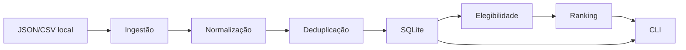

# Arquitetura

## Decisão Principal

Radar de Vagas é um monólito modular em Python. A aplicação roda localmente,
usa SQLite como banco e separa camadas por responsabilidade:

- CLI: entrada e apresentação no terminal.
- Configuração: leitura e validação de YAML e variáveis de ambiente.
- Ingestão: importação de fixture e arquivos JSON/CSV locais.
- Canonicalização: normalização de textos, URLs, empresas e localidades.
- Deduplicação: detecção exata de publicações e candidatos prováveis.
- Elegibilidade: regras puras e testáveis.
- Ranking: pontuação determinística e explicável.
- Persistência: SQLAlchemy, sessões, modelos e migrações Alembic.

## Dependências Permitidas

O projeto usa Python 3.12+, SQLAlchemy 2.x, Alembic, Pydantic 2.x, Typer, Rich,
PyYAML, pytest, Ruff e mypy. Não há Django, Flask, FastAPI, Streamlit,
PostgreSQL, Redis, Celery, Docker obrigatório, scraping, Playwright, APIs
externas ou modelos de IA.

## Fluxo

1. `radar init-db` cria diretórios e aplica migrações.
2. `radar validate-file` simula importações JSON/CSV sem escrita.
3. `radar import-file` valida, gera relatório opcional, cria fontes, empresas,
   publicações, auditoria de origem e vagas canônicas quando seguro.
4. `radar import-fixture` preserva o fluxo de teste do Marco 1.
5. `radar evaluate-all` aplica elegibilidade, arquiva incompatíveis e calcula
   ranking para elegíveis.
6. `radar list-jobs`, `radar show-job` e `radar stats` consultam o banco.

## Rollback

Na importação genérica, itens inválidos são separados antes da escrita. Para os
itens válidos, a unidade de rollback é o arquivo inteiro: uma falha inesperada
de persistência desfaz o lote de escrita para manter o banco previsível.

## Decisões Adiadas

- Coleta real de portais e ATS.
- Gmail e classificação de e-mails.
- Geração de currículo.
- Interpretação semântica de requisitos acadêmicos.
- Candidatura automática.
- Interface web.

## Por Que SQLite

SQLite atende ao escopo local-first, reduz configuração, facilita testes
isolados e evita infraestrutura externa. Microserviços foram evitados porque a
primeira versão precisa de coesão, portabilidade e simplicidade operacional.
