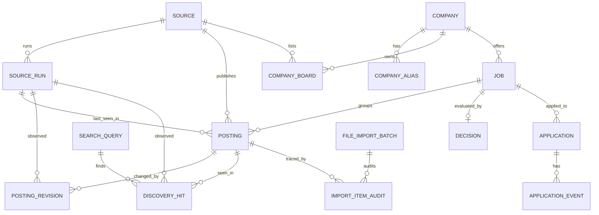

# Modelo de Dados

## Visao Geral

`Posting` representa uma publicacao encontrada em uma fonte. `Job` representa a
oportunidade canonica. Uma vaga real pode aparecer em varias publicacoes, mas a
uniao automatica so acontece quando for exata e segura.

## Entidades

`Source` guarda portais, ATS, alertas e importacoes manuais. `SourceRun`
representa uma execucao de ingestao ou coleta com inicio, fim, status e
contadores de itens.

`Company` guarda a organizacao canonica. `CompanyAlias` guarda variacoes
normalizadas do nome.

`CompanyBoard` mapeia boards publicos configurados. Campos principais:

- `key`
- `collector_type`
- `collection_scope_key`
- `external_identifier`
- `board_url`
- `configuration_json`
- `is_active`
- `last_checked_at`
- `last_success_at`
- `last_failed_at`
- `consecutive_failures`
- `last_etag`
- `last_modified`
- `last_complete_snapshot_at`
- `last_run_id`
- `disabled_reason`

`Posting` guarda dados brutos da publicacao, URL normalizada, hash de conteudo,
fonte e associacao opcional a `Job`. Para coleta incremental, tambem guarda:

- `collection_scope_key`
- `provider`
- `provider_scope`
- `provider_external_id`
- `provider_identity_key`
- `raw_department`
- `raw_area`
- `raw_requirements`
- `raw_responsibilities`
- `raw_technologies_json`
- `is_active`
- `missing_count`
- `closed_reason`

`collection_scope_key` diferencia boards mesmo quando eles usam o mesmo coletor
e o mesmo nome de empresa. O escopo e derivado de coletor e `key`, `board_token`
ou URL. `company_name` fica apenas como dado auxiliar de exibicao e
normalizacao.

`provider_identity_key` e unica quando presente e representa identidade estavel
da plataforma. Exemplos: `gupy:<job_id>`,
`greenhouse:<board_token>:<job_id>`, `lever:<board_token>:<posting_id>` e
`jobposting:<normalized_url>`. Importacoes antigas podem manter esses campos
nulos quando nao houver evidencia suficiente.

`SearchQuery` representa uma consulta de descoberta configurada. Ela guarda key,
coletor, modo, configuracao JSON, fingerprint deterministico, escopo estavel,
prioridade, tags, status e historico de execucao.

`DiscoveryHit` registra que uma consulta encontrou uma publicacao em uma
`SourceRun`. Ele aponta para `SearchQuery`, `SourceRun`, `Posting` e `Job`
quando disponiveis, e guarda posicao, pagina e metadados sanitizados sem
descricao integral. `match_status` pode indicar `new`, `known`, `changed` ou
`lifecycle_conflict`. O conflito aparece quando a consulta observacional encontra
uma publicacao fechada ou inativa sem ter autoridade para reabrir ou fechar.

`PostingRevision` registra mudancas observadas em uma publicacao conhecida:

- hash anterior
- novo hash
- campos alterados em JSON
- data de observacao
- `SourceRun` em que a mudanca foi vista

O HTML integral de respostas externas nao e duplicado em revisoes.

`Job` guarda a vaga canonica com tipo, modalidade, localidade, remuneracao,
status, departamento, area, requisitos, responsabilidades, tecnologias em JSON e
campos minimos para futura compatibilidade academica.

`Decision` guarda a ultima avaliacao de elegibilidade, motivo, nota,
detalhamento e relevancia profissional (`relevance_status`, `relevance_score`,
`relevance_reason_json`, `relevance_rules_version`).

`Application` e `ApplicationEvent` registram candidatura e evolucao do processo,
sem envio automatico nesta etapa.

`Resume` e `ResumeVersion` guardam estrutura para futuras versoes de curriculo,
sem geracao de arquivo.

`EmailMessage` guarda estrutura para futura integracao de e-mails, sem conexao
com Gmail nesta etapa.

`FileImportBatch` e `ImportItemAudit` registram auditoria de importacoes locais.

## Chaves e Indices

Publicacoes evitam duplicidade por identidade de plataforma quando presente,
fonte e identificador externo, fonte e URL normalizada, e hash de conteudo.
Consultas frequentes usam indices por status, atividade, ausencias, escopo de
coleta, tipo, modalidade, cidade, empresa e nota.

`CompanyBoard.key` e unico quando presente. Boards antigos sem key podem ser
migrados e atualizados posteriormente.
