# Modelo de Dados

## Visao Geral

`Posting` representa uma publicacao encontrada em uma fonte. `Job` representa a
oportunidade canonica. Uma vaga real pode aparecer em varias publicacoes, mas a
uniao automatica so acontece quando for exata e segura.

```mermaid
erDiagram
    SOURCE ||--o{ SOURCE_RUN : runs
    SOURCE ||--o{ POSTING : publishes
    SOURCE ||--o{ COMPANY_BOARD : lists
    SOURCE_RUN ||--o{ POSTING : last_seen_in
    SOURCE_RUN ||--o{ POSTING_REVISION : observed
    SOURCE_RUN ||--o{ DISCOVERY_HIT : observed
    COMPANY ||--o{ COMPANY_ALIAS : has
    COMPANY ||--o{ COMPANY_BOARD : owns
    COMPANY ||--o{ JOB : offers
    SEARCH_QUERY ||--o{ DISCOVERY_HIT : finds
    JOB ||--o{ POSTING : groups
    POSTING ||--o{ POSTING_REVISION : changed_by
    POSTING ||--o{ DISCOVERY_HIT : seen_in
    JOB ||--o| DECISION : evaluated_by
    JOB ||--o| JOB_REVIEW_STATE : reviewed_as
    JOB ||--o{ JOB_REVIEW_EVENT : review_events
    JOB ||--o{ APPLICATION : applied_to
    APPLICATION ||--o{ APPLICATION_EVENT : has
    APPLICATION ||--o{ APPLICATION_MATCH : matched_by
    JOB ||--o{ CAREER_EVENT : scheduled_for
    APPLICATION ||--o{ CAREER_EVENT : scheduled_for
    CAREER_EVENT ||--o{ CAREER_EVENT_AUDIT : audited_by
    PROFESSIONAL_PROFILE ||--o{ PROFESSIONAL_PROFILE_VERSION : versions
    PROFESSIONAL_PROFILE ||--o{ RESUME : has
    RESUME ||--o{ RESUME_VERSION : versions
    PROFESSIONAL_PROFILE_VERSION ||--o{ PROFILE_SKILL : skills
    PROFESSIONAL_PROFILE_VERSION ||--o{ PROFILE_EVIDENCE : evidences
    PROFESSIONAL_PROFILE_VERSION ||--o{ PROFESSIONAL_EXPERIENCE : experiences
    PROFESSIONAL_PROFILE_VERSION ||--o{ PROFILE_PROJECT : projects
    PROFESSIONAL_PROFILE_VERSION ||--o{ EDUCATION_CREDENTIAL : education
    PROFESSIONAL_PROFILE_VERSION ||--o{ LANGUAGE_SKILL : languages
    PROFESSIONAL_PROFILE ||--o{ PROFILE_ACTIVATION_EVENT : activation_audit
    PROFESSIONAL_PROFILE_VERSION ||--o{ PROFILE_ACTIVATION_EVENT : activation_audit
    JOB ||--o{ JOB_PROFILE_COMPARISON : compared_by
    PROFESSIONAL_PROFILE_VERSION ||--o{ JOB_PROFILE_COMPARISON : used_in
    JOB_PROFILE_COMPARISON ||--o{ JOB_REQUIREMENT_MATCH : explains
    FILE_IMPORT_BATCH ||--o{ IMPORT_ITEM_AUDIT : audits
    POSTING ||--o{ IMPORT_ITEM_AUDIT : traced_by
```

## Entidades

`Source` guarda portais, ATS, alertas e importacoes manuais. `SourceRun`
representa uma execucao de ingestao ou coleta com inicio, fim, status e
contadores de itens.

`Company` guarda a organizacao canonica. `CompanyAlias` guarda variacoes
normalizadas do nome.

`CompanyBoard` mapeia boards publicos configurados. Campos principais:

- `key`
- `collector_type`
- `collection_scope_key`
- `external_identifier`
- `board_url`
- `configuration_json`
- `is_active`
- `last_checked_at`
- `last_success_at`
- `last_failed_at`
- `consecutive_failures`
- `last_etag`
- `last_modified`
- `last_complete_snapshot_at`
- `last_run_id`
- `disabled_reason`

`Posting` guarda dados brutos da publicacao, URL normalizada, hash de conteudo,
fonte e associacao opcional a `Job`. Para coleta incremental, tambem guarda:

- `collection_scope_key`
- `provider`
- `provider_scope`
- `provider_external_id`
- `provider_identity_key`
- `raw_department`
- `raw_area`
- `raw_requirements`
- `raw_responsibilities`
- `raw_technologies_json`
- `is_active`
- `missing_count`
- `closed_reason`

`collection_scope_key` diferencia boards mesmo quando eles usam o mesmo coletor
e o mesmo nome de empresa. O escopo e derivado de coletor e `key`, `board_token`
ou URL. `company_name` fica apenas como dado auxiliar de exibicao e
normalizacao.

`provider_identity_key` e unica quando presente e representa identidade estavel
da plataforma. Exemplos: `gupy:<job_id>`,
`greenhouse:<board_token>:<job_id>`, `lever:<board_token>:<posting_id>` e
`jobposting:<normalized_url>`. Importacoes antigas podem manter esses campos
nulos quando nao houver evidencia suficiente.

`SearchQuery` representa uma consulta de descoberta configurada. Ela guarda key,
coletor, modo, configuracao JSON, fingerprint deterministico, escopo estavel,
prioridade, tags, status e historico de execucao.

`DiscoveryHit` registra que uma consulta encontrou uma publicacao em uma
`SourceRun`. Ele aponta para `SearchQuery`, `SourceRun`, `Posting` e `Job`
quando disponiveis, e guarda posicao, pagina e metadados sanitizados sem
descricao integral. `match_status` pode indicar `new`, `known`, `changed` ou
`lifecycle_conflict`. O conflito aparece quando a consulta observacional encontra
uma publicacao fechada ou inativa sem ter autoridade para reabrir ou fechar.

`PostingRevision` registra mudancas observadas em uma publicacao conhecida:

- hash anterior
- novo hash
- campos alterados em JSON
- data de observacao
- `SourceRun` em que a mudanca foi vista

O HTML integral de respostas externas nao e duplicado em revisoes.

`Job` guarda a vaga canonica com tipo, modalidade, localidade, remuneracao,
status, departamento, area, requisitos, responsabilidades, tecnologias em JSON e
campos minimos para futura compatibilidade academica.

`Decision` guarda a ultima avaliacao de elegibilidade, motivo, nota,
detalhamento e relevancia profissional (`relevance_status`, `relevance_score`,
`relevance_reason_json`, `relevance_rules_version`).

`JobReviewState` guarda o estado manual atual da vaga na fila de revisao:
`UNREVIEWED`, `SEEN`, `SHORTLISTED`, `DISMISSED` ou `APPLIED`.
`JobReviewEvent` registra historico append-only de acoes humanas. Mudancas de
estado passam pela politica central de revisao para impedir combinacoes
contraditorias entre `Job.status`, `JobReviewState` e candidaturas existentes.

`Application` registra candidatura feita manualmente fora do sistema. Campos
principais: `application_key`, `status`, `applied_at`, `platform`,
`external_reference`, `application_url`, `stage` e `notes`. `stage` separa o
andamento do processo seletivo do estado global da vaga e pode ser `APPLIED`,
`AWAITING_UPDATE`, `ASSESSMENT_RECEIVED`, `ASSESSMENT_COMPLETED`,
`CASE_RECEIVED`, `CASE_SUBMITTED`, `INTERVIEW_SCHEDULED`,
`INTERVIEW_COMPLETED`, `OFFER_RECEIVED`, `REJECTED` ou `WITHDRAWN`.
`ApplicationEvent` registra evolucao do processo com eventos como `SUBMITTED`,
`INTERVIEW_INVITED`, `REJECTED`, `OFFER_RECEIVED` e `WITHDRAWN`. `event_key`
e opcional e torna eventos importados ou reprocessados idempotentes por
candidatura. O estado resumido da candidatura e reconstruido por um redutor de
timeline a partir dos eventos gravados.

`ApplicationMatch` registra evidencias de vinculo entre historico externo e
vaga local. O match pode ser `EXACT`, `PROBABLE`, `UNMATCHED` ou
`CONFLICT`, com status local `LINKED`, `NEEDS_REVIEW` ou `IGNORED`.
`fingerprint` evita duplicar a mesma evidencia em importacoes repetidas.

`ProfessionalProfile` representa o perfil profissional local. Cada
`ProfessionalProfileVersion` guarda numero da versao, hash do arquivo local,
hash da estrutura validada, caminho local de origem, resumo e JSON estruturado
usado na avaliacao. Apenas uma versao pode ficar ativa globalmente. Mudancas de
ativacao sao registradas em `ProfileActivationEvent`.

`ProfileSkill`, `ProfileEvidence`, `ProfessionalExperience`, `ProfileProject`,
`EducationCredential` e `LanguageSkill` armazenam habilidades com evidencias,
experiencias, projetos, formacao e idiomas. Evidencias apontam para a versao do
perfil e opcionalmente para uma habilidade especifica.

`Resume` e `ResumeVersion` registram a importacao local versionada do curriculo
estruturado, sem gerar arquivo novo e sem versionar o arquivo real no Git. A
entidade base `Resume` e reutilizada por perfil; novas importacoes criam novas
`ResumeVersion` quando o conteudo muda.

`JobProfileComparison` guarda a comparacao entre uma vaga e uma versao de
perfil. `JobRequirementMatch` guarda cada requisito como obrigatorio ou
desejavel, com status `MATCHED`, `PARTIAL`, `NOT_PROVEN`, `NOT_MATCHED` ou
`AMBIGUOUS`, evidencias e explicacao. Tambem guarda origem do requisito, texto
original, termos avaliados e resultado por termo em JSON para auditoria
detalhada. A identidade da comparacao usa vaga, versao do perfil, versao das
regras e hash do conteudo da vaga, preservando historico quando a vaga ou as
regras mudam.

`CareerEvent` guarda agenda local de prazos, entrevistas, testes, cases,
documentos, ofertas e follow-ups. Ele pode apontar para uma vaga, uma
candidatura, ambas ou nenhuma delas. `CareerEventAudit` registra criacao,
atualizacao e mudancas de estado da agenda.

`FileImportBatch` e `ImportItemAudit` registram auditoria de importacoes locais.

## Chaves e Indices

Publicacoes evitam duplicidade por identidade de plataforma quando presente,
fonte e identificador externo, fonte e URL normalizada, e hash de conteudo.
Consultas frequentes usam indices por status, atividade, ausencias, escopo de
coleta, tipo, modalidade, cidade, empresa e nota.

`CompanyBoard.key` e unico quando presente. Boards antigos sem key podem ser
migrados e atualizados posteriormente.

`Application.application_key` e unico quando presente e evita duplicar
candidaturas importadas por identidade de plataforma, URL ou referencia externa.
`ApplicationEvent.application_id + event_key` e unico quando `event_key` esta
presente. `ApplicationMatch.fingerprint` e unico quando presente.

`ProfessionalProfileVersion` possui indice unico parcial para garantir uma
unica versao ativa global. `ProfileActivationEvent` mantem auditoria da troca
sem depender do historico editavel do perfil.

`JobProfileComparison` e unico por `job_id`, `profile_version_id`,
`rules_version` e `job_content_hash`. Reexecutar a mesma comparacao retorna o
registro existente; alterar vaga, perfil ou regras cria um novo historico.

`CareerEvent.event_key` e unico quando presente. Consultas de agenda usam
indices por data, tipo, status de confirmacao, vaga e candidatura.
