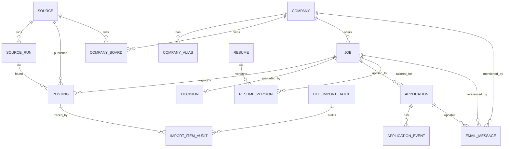

# Modelo de Dados

## Visão Geral

`Posting` representa uma publicação encontrada em uma fonte. `Job` representa a
oportunidade canônica. Uma vaga real pode aparecer em várias publicações, mas a
união automática só acontece quando for exata e segura.

## Entidades

`Source` guarda portais, ATS, alertas e importações manuais. `SourceRun`
representa uma execução de ingestão com contadores de itens.

`Company` guarda a organização canônica. `CompanyAlias` guarda variações
normalizadas do nome. `CompanyBoard` permite mapear páginas de carreira.

`Posting` guarda os dados brutos da publicação, URL normalizada, hash de
conteúdo, fonte e associação opcional a `Job`.

`Job` guarda a vaga canônica com tipo, modalidade, localidade, remuneração,
status e campos mínimos para futura compatibilidade acadêmica.

`Decision` guarda a última avaliação de elegibilidade, motivo, nota e detalhamento.

`Application` e `ApplicationEvent` registram candidatura e evolução do processo,
sem envio automático nesta etapa.

`Resume` e `ResumeVersion` guardam estrutura para futuras versões de currículo,
sem geração de arquivo.

`EmailMessage` guarda estrutura para futura integração de e-mails, sem conexão
com Gmail nesta etapa.

`FileImportBatch` registra origem de importações locais com caminho do arquivo,
hash, formato, versão de schema, modo de importação, horários e resumo.

`ImportItemAudit` registra linha ou índice original, payload bruto, payload
normalizado, status, duplicidade e associação opcional a `Posting` e `Job`.
O arquivo inteiro não é armazenado no banco.

## Chaves e Índices

Publicações evitam duplicidade por fonte e identificador externo, fonte e URL
normalizada, e hash de conteúdo. Consultas frequentes usam índices por status,
tipo, modalidade, cidade, empresa e nota.
