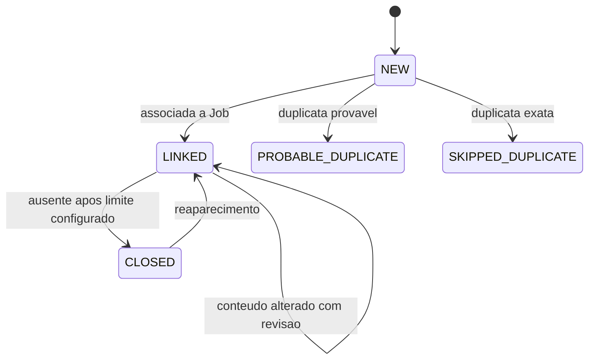
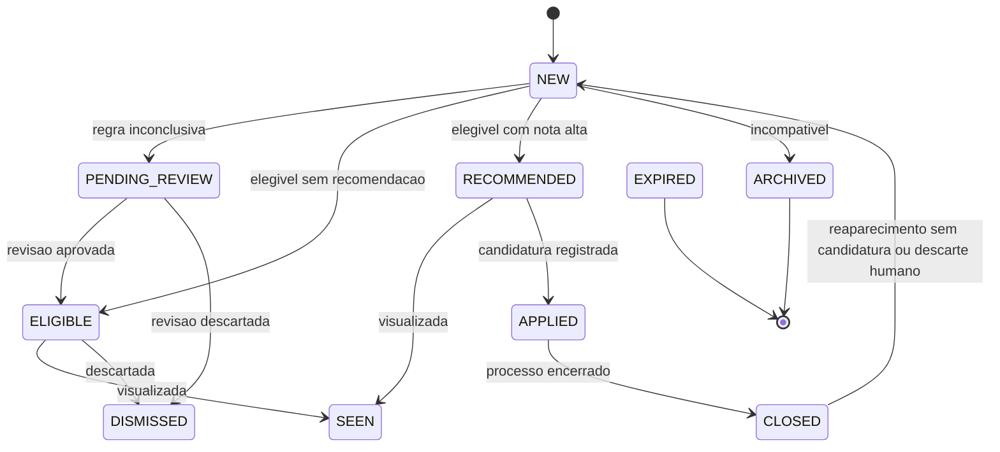
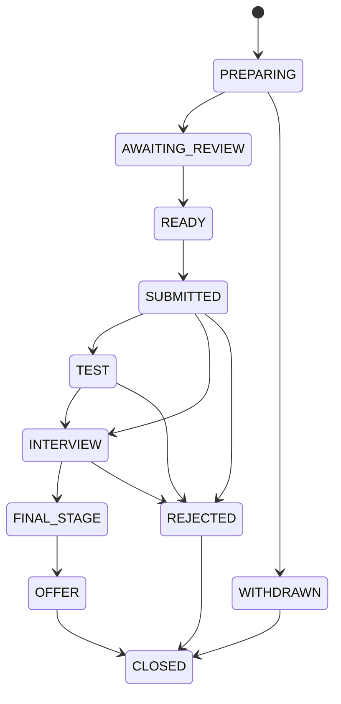

# Maquinas de Estado

## Publicacao

`CLOSED` em `Posting` significa que a publicacao deixou de aparecer em snapshots
completos bem-sucedidos. Falhas, snapshots parciais e HTTP 304 nao fecham
publicacoes.

## Vaga

`DISMISSED`, `APPLIED` e vagas com candidatura existente nao voltam ao ranking
automaticamente por causa de uma mudanca de publicacao. Quando houver
candidatura previa, a vaga passa a ser acompanhada como historico.

## Candidatura

A candidatura automatica e proibida nesta versao. O estado existe para rastrear
acoes humanas e preparar futuras integracoes controladas.
