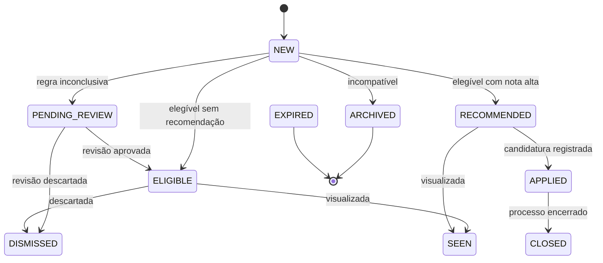
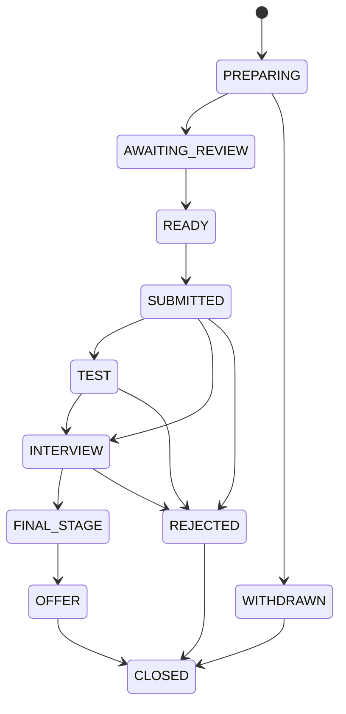

# Máquinas de Estado

## Vaga

`DISMISSED` e `ARCHIVED` não voltam ao ranking automaticamente. Quando houver
candidatura prévia, a vaga passa a ser acompanhada como histórico.

## Candidatura

A candidatura automática é proibida nesta versão. O estado existe para rastrear
ações humanas e preparar futuras integrações controladas.
