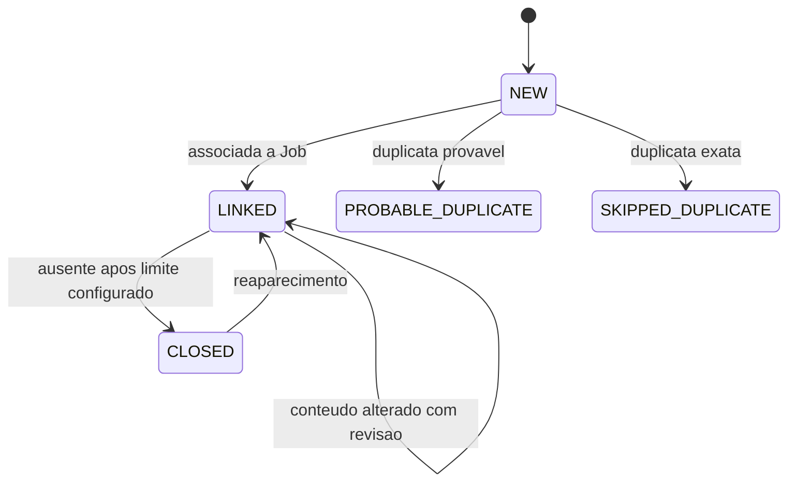
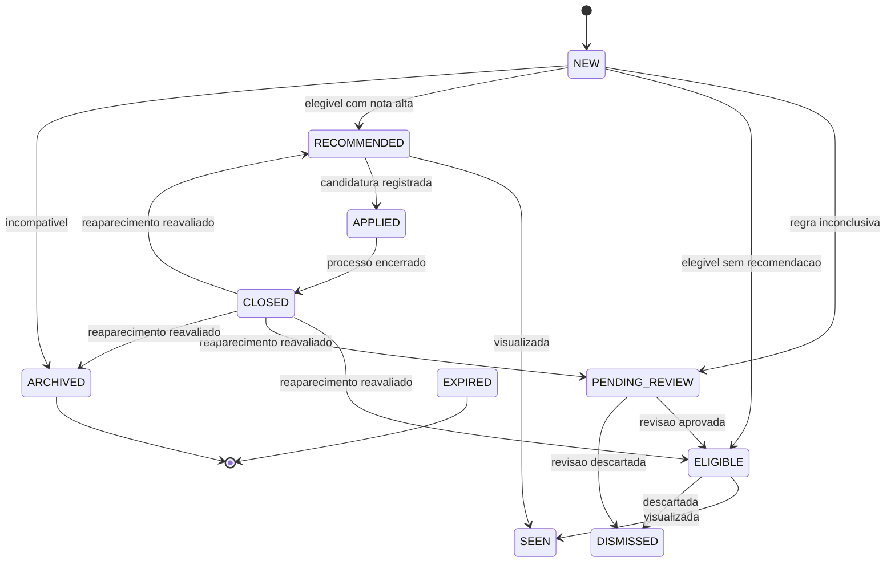
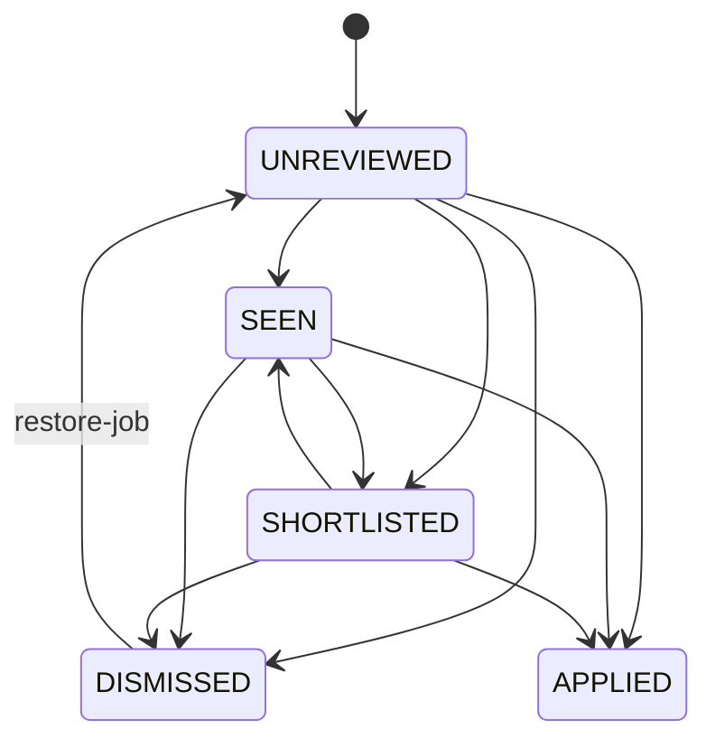
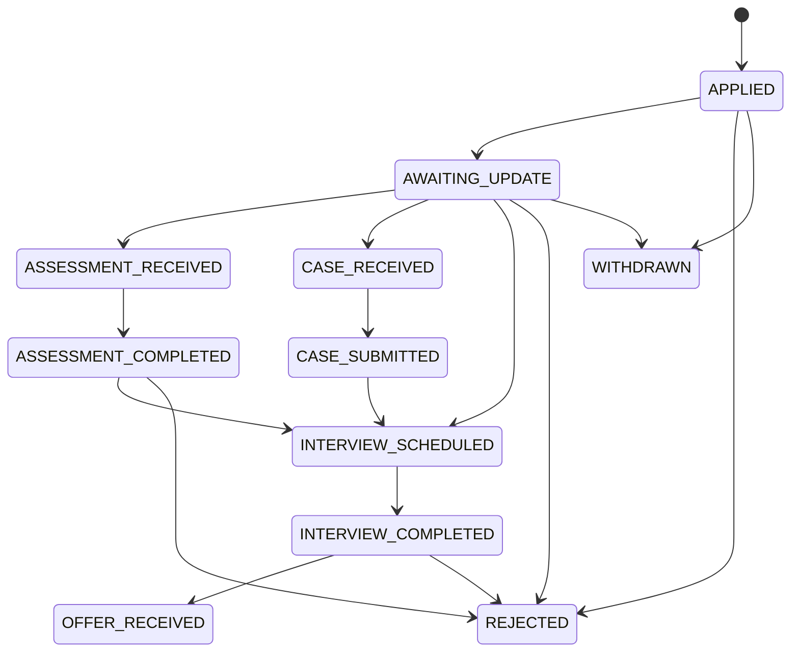
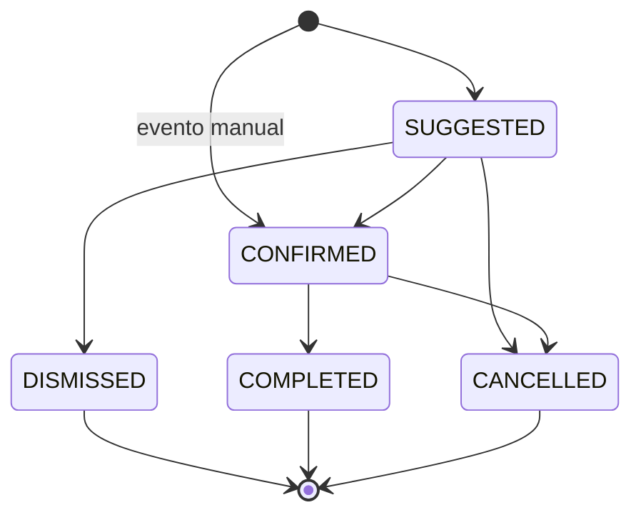

# Maquinas de Estado

## Publicacao

`CLOSED` em `Posting` significa que a publicacao deixou de aparecer em snapshots
completos bem-sucedidos. Falhas, snapshots parciais, payload truncado, itens
invalidos e HTTP 304 nao fecham publicacoes. Ausencia incrementa
`missing_count`, mas nao atualiza `last_seen_at`.

Consultas de descoberta (`DISCOVERY_QUERY`) e paginas individuais
(`SINGLE_PAGE`) nao fecham publicacoes. Mesmo uma consulta vazia, truncada,
parcial ou repetida apenas registra a execucao e nao interpreta ausencia como
encerramento.

Quando uma consulta de descoberta encontra uma publicacao fechada ou pertencente
a outro escopo autoritativo, ela registra a observacao sem reabrir, fechar,
zerar ausencia ou atualizar `last_seen_at` autoritativo.

## Vaga

Quando uma publicacao fechada reaparece, a vaga volta para avaliacao se nao
houver candidatura, aplicacao ou descarte humano protegendo o historico. Ela nao
fica parada em `NEW`: pode voltar como `ELIGIBLE`, `RECOMMENDED`,
`PENDING_REVIEW` ou `ARCHIVED`, conforme regras atuais.

`DISMISSED`, `APPLIED` e vagas com candidatura existente nao voltam ao ranking
automaticamente por causa de uma mudanca ou reaparecimento de publicacao.
Quando houver candidatura previa, a vaga passa a ser acompanhada como historico.
`radar reevaluate-jobs` segue a mesma protecao e nao sobrescreve esses estados.

Relevancia profissional afeta a transicao inicial: `UNRELATED` leva a
`ARCHIVED`, `MANUAL_REVIEW` leva a `PENDING_REVIEW`, `CORE` e `ADJACENT`
seguem elegibilidade e ranking. Incompatibilidades de empresa, localidade, tipo
e candidatura anterior prevalecem.

## Revisao Manual

`JobReviewState` e o estado atual. `JobReviewEvent` e append-only e guarda a
origem manual da mudanca. Todas as transicoes passam pela politica central de
revisao antes de alterar `Job.status`, `JobReviewState` ou gravar evento.

Transicoes validas:

- `UNREVIEWED` para `SEEN`, `SHORTLISTED`, `DISMISSED` ou `APPLIED`.
- `SEEN` para `SHORTLISTED`, `DISMISSED` ou `APPLIED`.
- `SHORTLISTED` para `SEEN`, `DISMISSED` ou `APPLIED`.
- `DISMISSED` para `UNREVIEWED` somente via `restore-job`.

Estados `APPLIED`, `CLOSED` e `EXPIRED` bloqueiam a revisao manual comum.
Vagas com candidatura existente tambem bloqueiam `mark-seen`, `shortlist` e
`dismiss-job`; a vaga deve ser acompanhada pelo historico de candidatura.

`restore-job` limpa o descarte humano ativo, reavalia a vaga com as regras
atuais e nao restaura vagas `APPLIED`, `CLOSED` ou `EXPIRED`.

## Candidatura

A candidatura automatica e proibida nesta versao. O estado existe para rastrear
acoes humanas feitas fora do Radar.

Eventos manuais ou importados atualizam o resumo da candidatura, mas nao abrem
links externos e nao executam candidatura em plataforma. `SUBMITTED` registra
que o usuario aplicou fora do Radar; `CONFIRMATION_RECEIVED` e eventos
posteriores acompanham o processo.

O resumo de `Application.status` e `Application.stage` e derivado por redutor de
timeline. O redutor ordena eventos por data e usa a sequencia resultante para
reconstruir a etapa atual. Eventos informativos, como confirmacao recebida e
atualizacao de processo, nao regridem uma etapa mais avancada. Um evento antigo
inserido depois nao derruba uma etapa mais recente. Eventos terminais, como
rejeicao ou retirada, podem ser substituidos por um evento posterior explicito,
por exemplo uma entrevista registrada depois de uma rejeicao importada
incorretamente.

`ApplicationEvent.event_key` evita duplicidade em reprocessamentos. Quando um
evento precisa ser recalculado, `radar rebuild-application-stage` recompoe o
estado resumido a partir da timeline persistida.

## Agenda Local

Eventos de agenda nao fazem integracao externa. Eventos manuais podem nascer
confirmados. Eventos vindos de descricao de vaga, e-mail importado ou estimativa
nascem como sugestao. Eventos estimados nunca viram compromisso confirmado sem
nova entrada manual mais confiavel.

Reaplicar a mesma transicao terminal ou de confirmacao e idempotente: o Radar
nao duplica auditoria nem reescreve timestamps. Edicoes estruturais de eventos
terminais sao bloqueadas para preservar historico.
