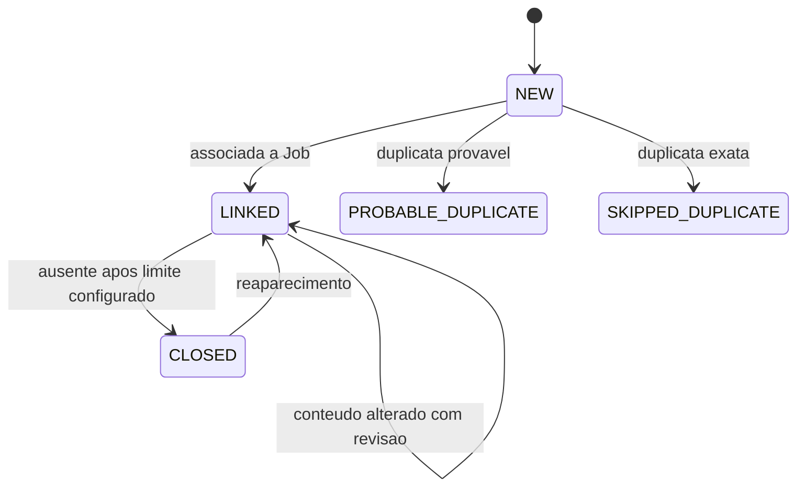
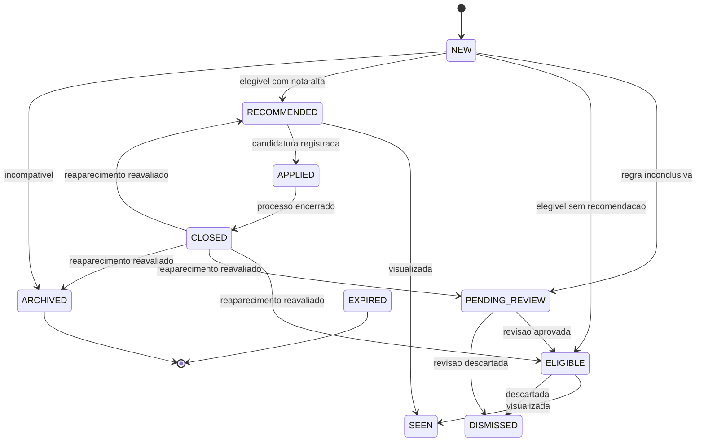
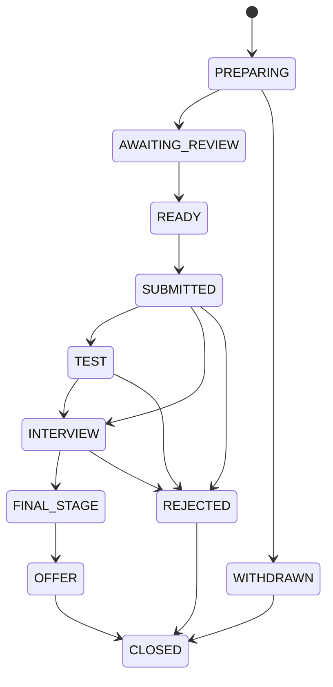

# Maquinas de Estado

## Publicacao

`CLOSED` em `Posting` significa que a publicacao deixou de aparecer em snapshots
completos bem-sucedidos. Falhas, snapshots parciais, payload truncado, itens
invalidos e HTTP 304 nao fecham publicacoes. Ausencia incrementa
`missing_count`, mas nao atualiza `last_seen_at`.

Consultas de descoberta (`DISCOVERY_QUERY`) e paginas individuais
(`SINGLE_PAGE`) nao fecham publicacoes. Mesmo uma consulta vazia, truncada,
parcial ou repetida apenas registra a execucao e nao interpreta ausencia como
encerramento.

Quando uma consulta de descoberta encontra uma publicacao fechada ou pertencente
a outro escopo autoritativo, ela registra a observacao sem reabrir, fechar,
zerar ausencia ou atualizar `last_seen_at` autoritativo.

## Vaga

Quando uma publicacao fechada reaparece, a vaga volta para avaliacao se nao
houver candidatura, aplicacao ou descarte humano protegendo o historico. Ela nao
fica parada em `NEW`: pode voltar como `ELIGIBLE`, `RECOMMENDED`,
`PENDING_REVIEW` ou `ARCHIVED`, conforme regras atuais.

`DISMISSED`, `APPLIED` e vagas com candidatura existente nao voltam ao ranking
automaticamente por causa de uma mudanca ou reaparecimento de publicacao.
Quando houver candidatura previa, a vaga passa a ser acompanhada como historico.
`radar reevaluate-jobs` segue a mesma protecao e nao sobrescreve esses estados.

Relevancia profissional afeta a transicao inicial: `UNRELATED` leva a
`ARCHIVED`, `MANUAL_REVIEW` leva a `PENDING_REVIEW`, `CORE` e `ADJACENT`
seguem elegibilidade e ranking. Incompatibilidades de empresa, localidade, tipo
e candidatura anterior prevalecem.

## Candidatura

A candidatura automatica e proibida nesta versao. O estado existe para rastrear
acoes humanas e preparar futuras integracoes controladas.
